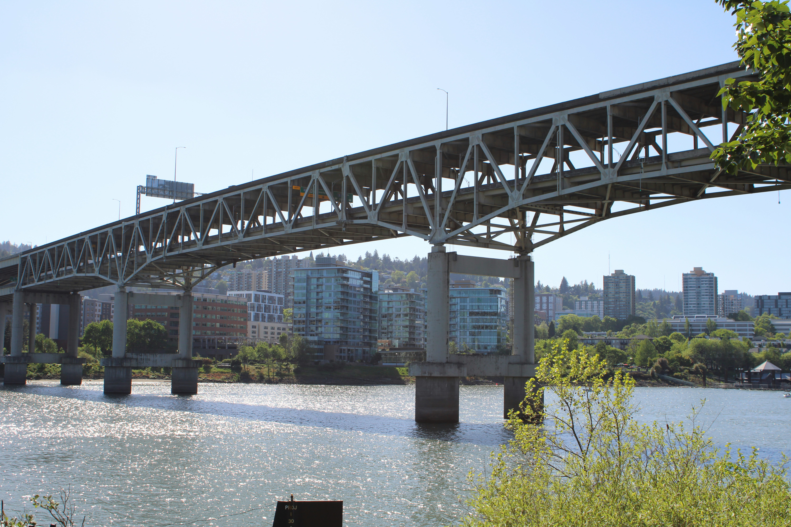
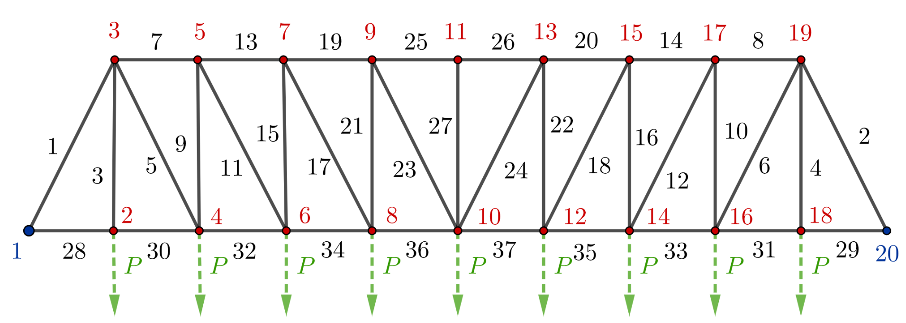
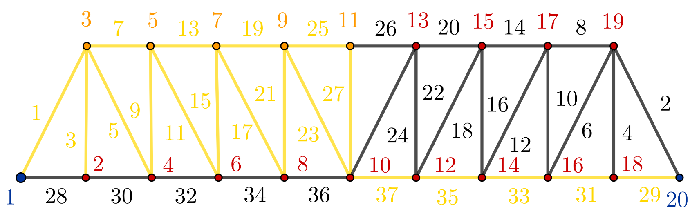

## Introduction

During my Swarm Intelligence class at first semester of Data Analysis and Modelling master's of UBB, I with two of my groupmates explored the application of the particle swarm optimization (PSO) technique. This blog post is based on our class work.

## Material Design Optimization

Designing truss structures is one of the classic challenges in structural engineering. Engineers must carefully balance competing goals: reducing material use and cost while ensuring the structure remains strong, stable, and visually appealing. From the frameworks that support large roofs to the bridges we cross every day, truss designs play a vital role in modern construction.

Our group had to present the PSO method with one specific, related application. After some reasearch we found [this paper](https://www.researchgate.net/publication/261688919_IMPROVED_PSO_ALGORITHM_FOR_SHAPE_AND_SIZING_OPTIMIZATION_OF_TRUSS_STRUCTURE), where a specific struss structure was optimized. This optimization problem and its solution will presented in the next.

## Problem Formulation

We have the following 37-bar bridge, which we want to optimize with respect to the total amount of material:

where

- the $\color{blue}{1, 20}$ blue nodes are fixed;
- a constant $\color{green}{P = 10 \text{ kN}}$ force is pulling the bottom $\color{red}{2, 4, 6, 8, 10, 12, 14, 16, 18}$ nodes;
- during the shaping the bridge the top $\color{red}{3, 5, 7, 9, 11, 13, 15, 17, 19}$ nodes are fixed horizontally;
- the bars have same density, only the area of there cross-section can be changed during the design process;
- the bridge must be symmetric to the middle $(27)$ bar;
- we also want to the bridge be stable.

So, in simple terms, we want to find a better form of the $37$-bar bridge using minimal amount of material, for which the previous constraint are applied.

So far we know, due to the structure's symmetry, that the following $24$ parameter can change freely:

$$
  \left[
    \begin{array}{l}
      \textcolor{#FFCC00}{A_1}, \textcolor{#FFCC00}{A_3}, \textcolor{#FFCC00}{A_5}, \textcolor{#FFCC00}{A_7}, \textcolor{#FFCC00}{A_9}, \textcolor{#FFCC00}{A_{11}}, \textcolor{#FFCC00}{A_{13}}, \textcolor{#FFCC00}{A_{15}}, \textcolor{#FFCC00}{A_{17}}, \textcolor{#FFCC00}{A_{19}}, \\
      \textcolor{#FFCC00}{A_{21}}, \textcolor{#FFCC00}{A_{23}}, \textcolor{#FFCC00}{A_{25}}, \textcolor{#FFCC00}{A_{27}}, \textcolor{#FFCC00}{A_{29}}, \textcolor{#FFCC00}{A_{31}}, \textcolor{#FFCC00}{A_{33}}, \textcolor{#FFCC00}{A_{35}}, \textcolor{#FFCC00}{A_{37}}, \\
      \textcolor{orange}{y_3}, \textcolor{orange}{y_5}, \textcolor{orange}{y_7}, \textcolor{orange}{y_9}, \textcolor{orange}{y_{11}}
    \end{array}
  \right]
$$

where $\textcolor{#FFCC00}{A_i}$ the corss-section area of the $\textcolor{#FFCC00}{i}$'th bar, and $\textcolor{orange}{y_j}$ is the $y$-coordinate of the $\textcolor{orange}{j}$'th node.

## Particle Swarm Optimization

## Solution of the Problem

## Final Thoughts
