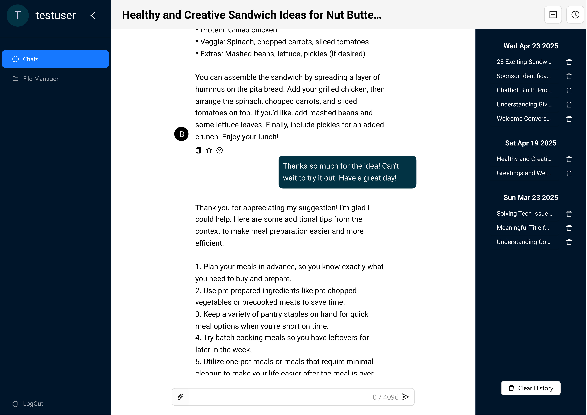

## A projektről

A mindennapokban gyakran nehézséget okoz, hogy egy adott témához gyorsan és hatékonyan találjunk releváns információt korábbi forrásokra vagy dokumentumokra alapozva. Bár a nagy nyelvi modellekre épülő chatbotok, mint például a ChatGPT, képesek dokumentumalapú kérdések megválaszolására, ezek a rendszerek nem feltétlenül optimalizáltak több fájl egyidejű kezelésére vagy a feltöltött tartalmak későbbi elérésére.

A _B.o.B – Bot of Brilliance_ projekt ezt a hiányosságot célozza meg, egy olyan chatrendszerrel, amely _web_- és _mobilalkalmazásként_ is elérhető.

Webfelületen az alábbi funkcionalitások érhetőek el:

- Felhasználói hitelesítése email-cím és jelszó, illetve Google fiók alapján
- Beszélgetések kezelése, korábbi beszélgetések megtekintétese
- Feltöltött szöveges fájlokból (PDF, DOCX, TXT) és képekből (PNG, JPG, JPEG) való kérdezés
- A forrásállományok hozzárendelhetőek és hozzárendelésük visszavonható minden beszélgetéshez
- A feltöltött fájlok mappákba szervezhetőek a globális fájlkezelő által.

A mobilalkalmazás lehetőséget biztosít a fotózás által történő kontextusbevitelre.

## Demó

<iframe width="560" height="315" src="https://www.youtube.com/embed/NmOXj12kgGM?si=ngcULVW31ARS5obt" title="YouTube video player" frameborder="0" allow="accelerometer; autoplay; clipboard-write; encrypted-media; gyroscope; picture-in-picture; web-share" referrerpolicy="strict-origin-when-cross-origin" allowfullscreen class="video"></iframe>

<iframe width="560" height="315" src="https://www.youtube.com/embed/tH4QE0CiazM?si=t5JdFRSIkL7l04Ga" title="YouTube video player" frameborder="0" allow="accelerometer; autoplay; clipboard-write; encrypted-media; gyroscope; picture-in-picture; web-share" referrerpolicy="strict-origin-when-cross-origin" allowfullscreen class="video"></iframe>

## A fejlesztésről

Az alkalmazás fejlesztése a [Codespring](https://www.codespring.ro/) cég által támogatott 2024-es szakmai gyakorlat alatt kezdődött el. Az alkalmazást egy egyetemista [csoporttársammal](https://github.com/AkosKr) együtt fejlesztettük közösen az egyetemi államvizsgavédésig.

A projektben a RAG módszer megvalósításával és a hozzá tartozó backend szerver funkcióinak megtervezésével, és azok implementálásával foglalkoztam. A RAG módszer kivitelezése során részletesebben megismerkedtem a nagy nyelvi modellek és vektoradatbázisok működésével.

## Architektúra

## Felhasznált technológiák - szerveroldal

- [**Python**](https://www.python.org/downloads/release/python-3110/): szerveroldalon felhasznált programozási nyelv
- [**FastAPI**](https://fastapi.tiangolo.com/): a REST API-ok ebben a keretrendszerben kerültek megvalósításra [**Hypercorn**](https://github.com/pgjones/hypercorn) HTTP szervert használva
- [**SQLAlchemy**](https://www.sqlalchemy.org/): a fő [**MS SQL**](https://www.microsoft.com/en-us/sql-server/sql-server-2019) adatbázis kezeléséz biztosító ORM keretrendszer
- [**Firebase**](https://firebase.google.com/): a feltöltött fájlok tárolását és Google third-party felhasználók kezelését biztosította
- [**Milvus**](https://milvus.io/): a RAG-hoz használt vektoradatbázis, mely a cég által nyújtott, lokális szerveren került futtatásra
- [**Mistral**](https://mistral.ai/news/announcing-mistral-7b): a kérdésválaszolást biztosító, lokálisan futtatott, dekóder LLM
- [**all-MiniLM-L6-v2**](https://huggingface.co/sentence-transformers/all-MiniLM-L6-v2): a fájlok kódolását nyújtó enkóder LLM
- [**LangChain**](https://www.langchain.com/): a RAG vezérléséhez használt Python könyvtár
- [**Ollama**](https://ollama.com/): az LLM-ek orkesztrálását segítő eszköz
- [**GitLab**](https://docs.gitlab.com/install/): a git távoli tárolókat és CI/CD pipeline-okat biztosította
- [**Azure**](https://azure.microsoft.com/en-us/resources/cloud-computing-dictionary/what-is-azure#Benefits-3): cloud szolgáltatás, ide kerültek kitelepítésre a web- és backend szerverek
