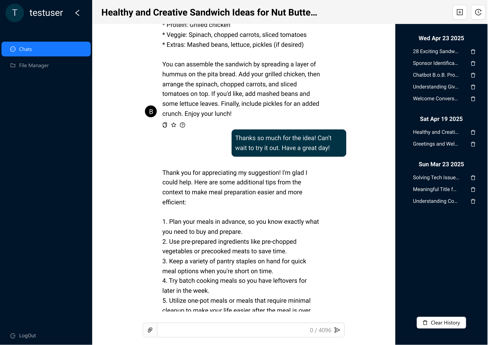
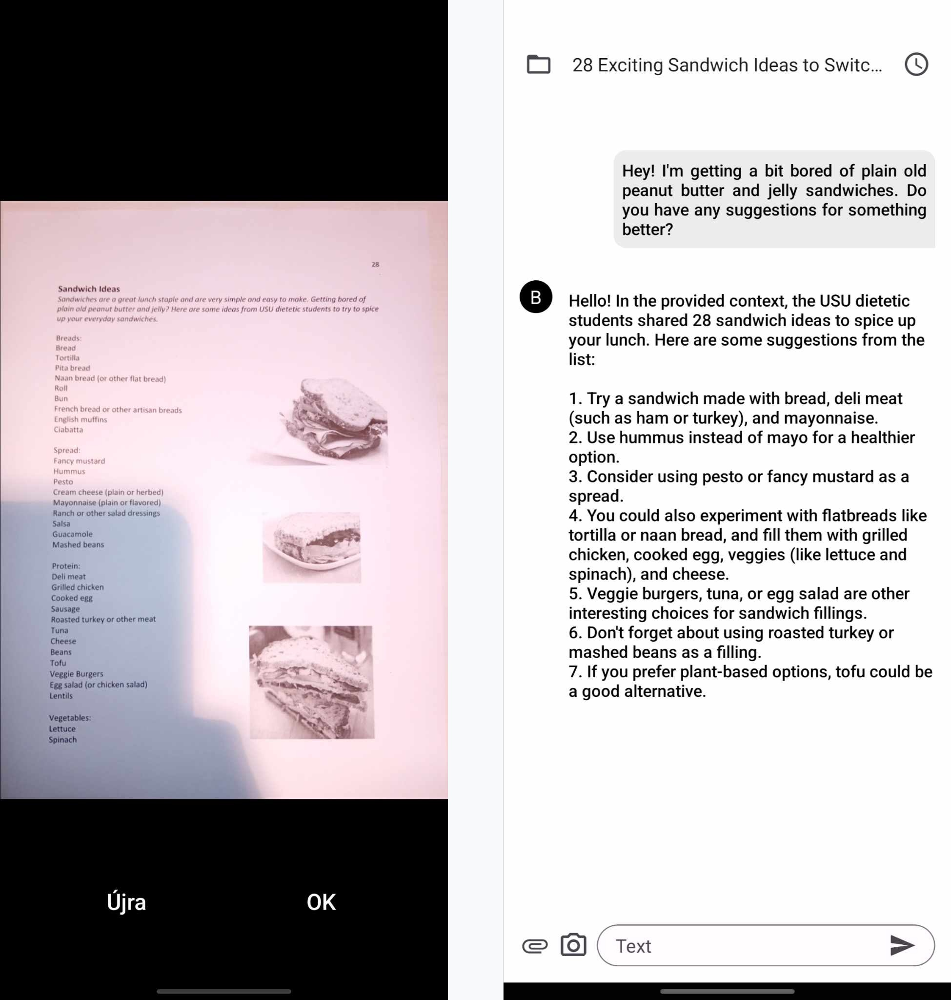
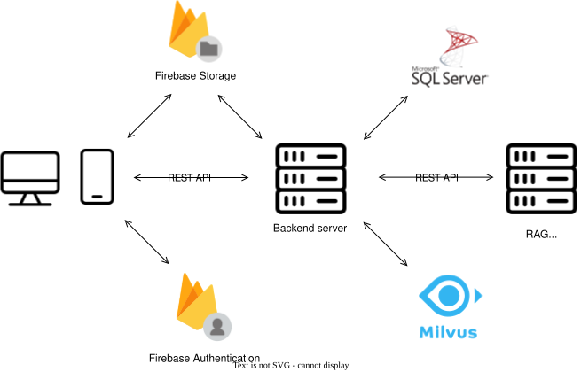
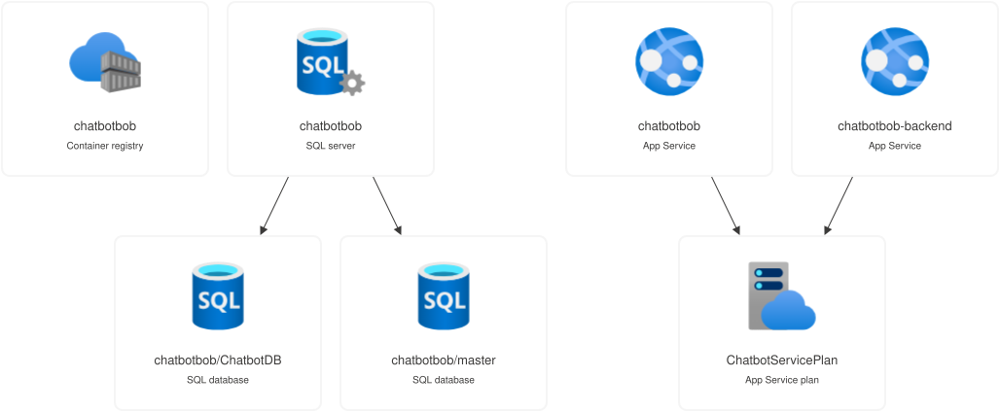
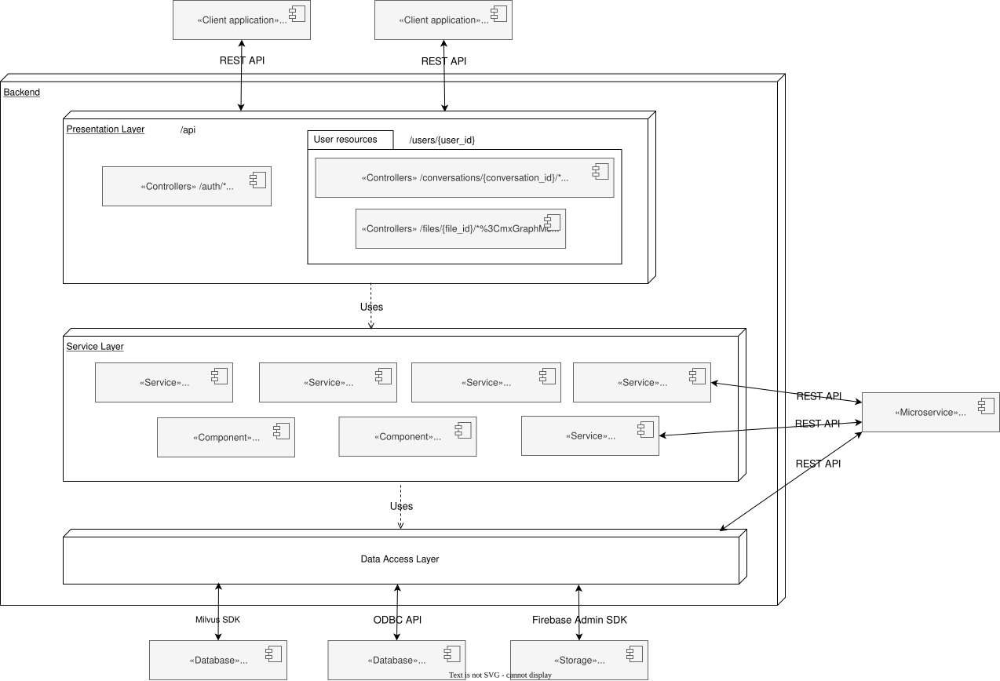
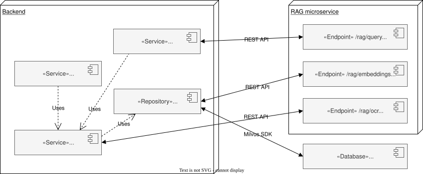

## About the project

In daily life, quickly and efficiently **finding relevant information** on a specific topic **from existing sources** or documents can be **challenging**. While large language model-based chatbots, like ChatGPT, can answer questions based on documents, they are not always designed to handle multiple files at once or to retain efficient access to uploaded content for future use.

The **B.o.B: Bot of Brilliance** project addresses these shortcomings by providing access to a chat system available as both web and mobile applications.

The web platform provides the following **functionalities**:

- User **authentication** via email and password or through a Google account.
- Viewing and **managing previous conversations**.
- **Asking questions based on uploaded** text **files** (PDF, DOCX, TXT) and image files (PNG, JPG).
- **Attaching and detaching** source **files to** and from existing **conversations**.
- Organizing uploaded files into folders using a **global file explorer**.

The **mobile application** allows users to provide **contextual input through photos**.

## Demo

<iframe width="560" height="315" src="https://www.youtube.com/embed/NmOXj12kgGM?si=ngcULVW31ARS5obt" title="YouTube video player" frameborder="0" allow="accelerometer; autoplay; clipboard-write; encrypted-media; gyroscope; picture-in-picture; web-share" referrerpolicy="strict-origin-when-cross-origin" allowfullscreen class="video"></iframe>

<iframe width="560" height="315" src="https://www.youtube.com/embed/tH4QE0CiazM?si=t5JdFRSIkL7l04Ga" title="YouTube video player" frameborder="0" allow="accelerometer; autoplay; clipboard-write; encrypted-media; gyroscope; picture-in-picture; web-share" referrerpolicy="strict-origin-when-cross-origin" allowfullscreen class="video"></iframe>

## About the development

The development of the application began in **2024 during my internship** at [**Codespring**](https://www.codespring.ro/). I worked on the project together with my university group mate, and we continued developing it throughout our studies until the defense of our bachelor's thesis.

In the project, **I was responsible for designing and implementing the Retrieval Augmented Generation (RAG) approach**, as well as the related **backend** server **functionalities**. Through the implementation of the RAG method, **I gained** a deeper **understanding of** the inner workings of **LLMs and vector databases**.

## Server side technologies

- [**Python**](https://www.python.org/downloads/release/python-3110/): programming language used on the server side
- [**FastAPI**](https://fastapi.tiangolo.com/): framework used to implement the REST APIs, running on the [**Hypercorn**](https://github.com/pgjones/hypercorn) HTTP server
- [**SQLAlchemy**](https://www.sqlalchemy.org/): ORM framework used to manage the primary [**MS SQL**](https://www.microsoft.com/en-us/sql-server/sql-server-2019) database
- [**Firebase**](https://firebase.google.com/): provided storage for uploaded files and handled Google third-party user authentication
- [**Milvus**](https://milvus.io/): vector database used for RAG, deployed on a **local server** provided by the company
- [**Mistral**](https://mistral.ai/news/announcing-mistral-7b): locally hosted decoder LLM responsible for question answering
- [**all-MiniLM-L6-v2**](https://huggingface.co/sentence-transformers/all-MiniLM-L6-v2): encoder LLM used for embedding uploaded files
- [**LangChain**](https://www.langchain.com/): Python library used to orchestrate the RAG pipeline
- [**Ollama**](https://ollama.com/): tool used for orchestrating and managing LLMs
- [**GitLab**](https://docs.gitlab.com/install/): provided remote Git repositories and CI/CD pipelines
- [**Azure**](https://azure.microsoft.com/en-us/resources/cloud-computing-dictionary/what-is-azure#Benefits-3): cloud platform used to deploy the containerized web and backend servers

## Achievements

- Awarded **2nd place** at the _XXVIII. Transylvanian Scientific Student Conference, Informatics II: Innovative Computing Products and Applications_.
- **Paper published** at the _IEEE 23rd International Symposium on Intelligent Systems and Informatics (SISY 2025)_; a preprint is available [here](https://edu.codespring.ro/wp-content/uploads/2025/10/BOB___Copy_.pdf), with the final IEEE version accessible [here](https://doi.org/10.1109/SISY67000.2025.11205379).

## Architecture

## Final Thoughts

I would like to thank [Codespring](https://www.codespring.ro/) for providing the opportunity and support during my internship, which made this project possible. The experience allowed me to apply my knowledge in a real-world setting and gain valuable skills in software development and AI integration.
