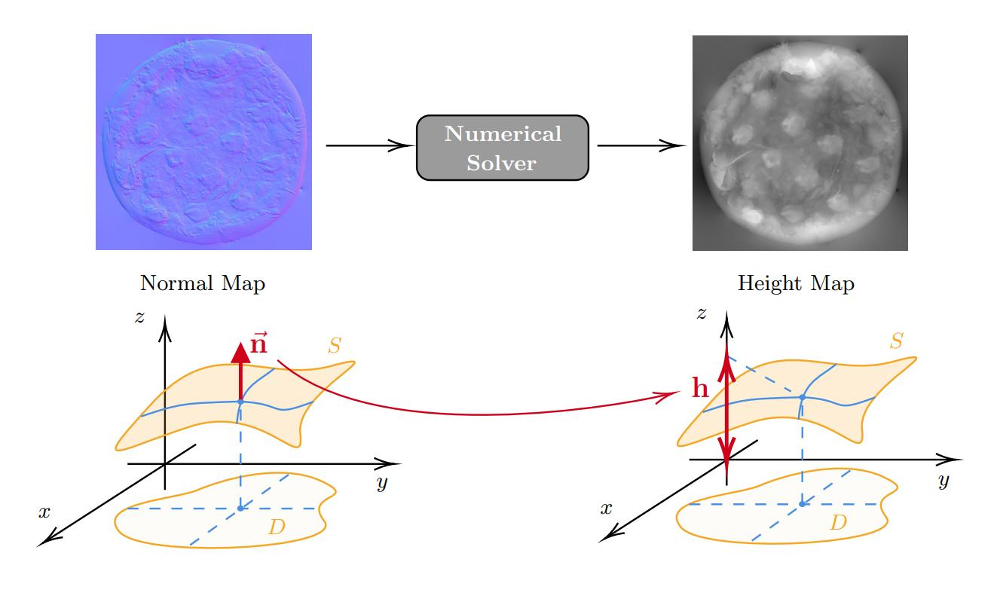
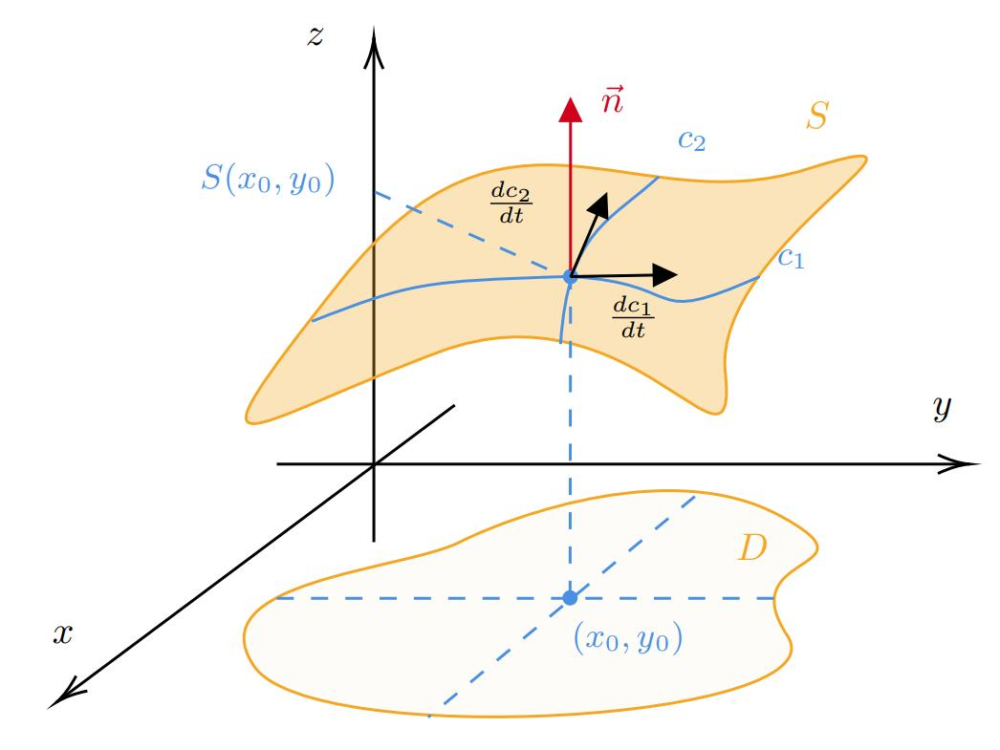
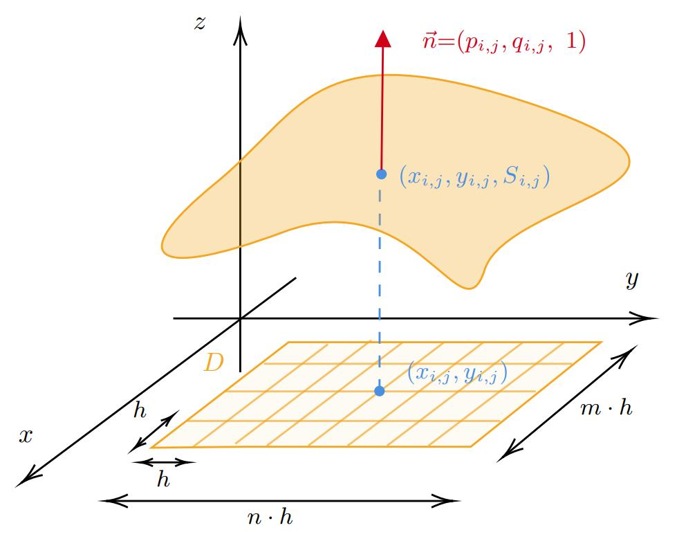

## About the Project

Turning flat photographs into 3D models, detecting subtle surface defects in manufacturing, or measuring skin wrinkles all require an understanding of a surface's three-dimensional shape. One way to recover this information is by estimating a **height map**--a representation of how the surface rises and falls--from a **normal map**, which describes the orientation of the surface at each pixel.

While a normal map captures the direction each tiny patch of the surface is facing, it does not directly provide the actual height. Recovering those heights is a challenging mathematical problem with no exact solution for general surfaces, so practical algorithms rely on numerical approximations.

Since modern images often contain millions of pixels, reconstructing a height map can become computationally expensive. To address this, I implemented and evaluated several reconstruction methods, comparing their execution time, memory consumption, and reconstruction accuracy.

Because these algorithms are highly parallelizable, they are well suited for execution on modern GPUs. To create a portable, cross-platform solution, I implemented the GPU kernels using [**OpenCL**](https://www.khronos.org/opencl/), with **Python** serving as the host language.

### Links

- The source code is available in this GitHub repository (...).
- A future blog post will discuss the algorithms, implementation details, and performance evaluation in depth.

 

The following sections outline the key details of the project.

## Problem Formulation

Before any implementation the first thing is to phrase the problem matematically and reduce the problem as much as possible.

The surface $S$ is a function which maps 2D points to real values: $S: D \subset \mathbb{R}^2 \to \mathbb{R}$.

Our goal is to find all $(x_0, y_0, S(x_0, y_0))$ points on the surface $S$ knowing only the $\vec{n}(x_0, y_0) \in \mathbb{R}^3$ normal vector for all $(x_0, y_0)$.

If $\vec{n}(x, y) = (n_1(x, y), n_2(x, y), n_3(x, y))$, then it turns out that finding $S$ is equivalent to solve the following.

$$
\begin{align*}
  \begin{cases}
    \dfrac{\partial S}{\partial x}(x, y) = -\dfrac{n_1(x, y)}{n_3(x, y)},\\
    \dfrac{\partial S}{\partial y}(x, y) = -\dfrac{n_2(x, y)}{n_3(x, y)}
  \end{cases}
\end{align*}
$$

The previous system, in general, is hard to solve numerically. By using mean squared error minimization we can reformulate it in the following reduced form

$$
\begin{align}
  \begin{cases}
    \dfrac{\partial^2 S}{\partial x^2} + \dfrac{\partial^2 S}{\partial y^2} = \dfrac{\partial p}{\partial x} + \dfrac{\partial q}{\partial x}, \quad \text{ on } D,\\
    S(x_\ast, y_\ast) = 0,
  \end{cases}
\end{align}
$$

where $p := -\frac{n_1}{n_3}, \quad q := -\frac{n_2}{n_3}$ and $(x_\ast, y_\ast) \in D$ is a fixed reference point for initial hight (for the reconstructed surface we don't haved fixed reference).

So our goal is to find the unique solution $S$ of the PDE $(1)$.

## Solutions

We can solve $(1)$ in two different ways: approximating $S$ pointwise or uniformly. Pointwise approximations are applicable more generally but they are not as accurate as the uniform approximations.

### Discretization

**Idea:** split the rectangular domain $D$ in small parts by using a lattice, i.e consider the surface only at the pixel locations.

So we can rewrite $(1)$ as a linear system of equations:

$$
\begin{align}
  \begin{cases}
      S_{i + 1, j} + S_{i, j + 1} + S_{i - 1, j} + S_{i, j - 1}
          - 4S_{i, j}
      =
      h^2(\Delta p_{i, j} + \Delta q_{i, j})\\
      \text{where } i = \overline{0, m - 1}, j = \overline{0, n - 1},\\
      S(x_\ast, y_\ast) = 0,
  \end{cases}
\end{align}
$$

where

- $(x_{i, j}, y_{i, j})$ lattice points, $p_{i, j} := p(x_{i, j}, y_{i, j}),\ q_{i, j} := q(x_{i, j}, y_{i, j}),\ S_{i, j} := S(x_{i, j}, y_{i, j})$, $i = \overline{0, m - 1}, j = \overline{0, n - 1}$;
- $\Delta p_{i, j}, \Delta q_{i, j}$ are the corresponding, proper, finite differences of $p_{i, j}, q_{i, j}$.

The system $(2)$ can be solved directly using **Gauss Elimation**. The problem of this approach is that for only a 1K image will require 8TB of memory. We can reduce the memory consumption using sparse matrices, but even then the method won't scale well for larger (4K, 8K) images.

One way to tackle this problem is to use iterative methods like **Jacobi** and **Gauss-Siedel**. This methods approximate the solution of the system $(2)$ by iterative updates. The update rules can be seprated properly for handling the syncornization during GPU parallelization effortlessly. The Gauss-Seidel method is a bit more complex to implement but reusing the available information will converge two times faster than the Jacobi method.

Technical details

- Let $S_{0, 0} = S(x_{0, 0}, y_{0, 0}) = 0 \Rightarrow$ reduce $(2)$ by substituting $S_{0, 0} = 0$ into the equations and leaving out
  $$
    \begin{align*}
      S_{1, 0} + S_{0, 1} + S_{-1, j} + S_{0, -1}
              - 4S_{0, 0}
      =
      h^2(\Delta p_{0, 0} + \Delta q_{0, 0})
    \end{align*}
  $$
- $A =: D - L - U$; $D = \text{diag } A$; $-L, -U$ lower and upper triangular matrices of $A$
- $N := m\cdot n - 1$, $A =: [a_{i, j}]_{i, j = \overline{0, N}}$
- Jacobi method's update rule
  $$
    \begin{align*}
      x^{(k + 1)} &= D^{-1}(L + U)x^{(k)} + D^{-1}b\\
      x_i^{(k + 1)} &= \frac{1}{a_{i,i}}\left(b_i - \sum_{j \neq i} a_{i,j}x_j^{(k)}\right), \quad j = \overline{0, N}
    \end{align*}
  $$
- Gauss-Seidel methods update rule
  $$
    \begin{align*}
        x^{(k + 1)} &= (D - L)^{-1}U x^{(k)} + (D - L)^{-1}b\\
        x_i^{(k + 1)} &= \frac{1}{a_{i,i}}\left(b_i - \sum_{j = 1}^{i-1} a_{i,j}x_j^{(k + 1)} - \sum_{j = i + 1}^{N} a_{i,j}x_j^{(k)}\right), \quad j = \overline{0, N}
    \end{align*}
  $$
- They conververge only for special type of matrices. It can be shown for $A$ both methods will converge with exponential decay ($A$ is irreducibly diagonally dominant).
- It can be observed that Gauss-Seidel re-uses already calculated values in the current iteration. It can be implemented parallely without any syncronization overhead using red-black coloring.

### Fast Fourier Transform

**Idea:** approximate the function $S(x, y)$ by using more simpler functions which behave nicely against the PDE $(1)$.

We can write $S(x, y), \ p(x, y), \ q(x, y)$ as linear combinations of complex exponentials $\exp(j\omega_x x + j\omega_y y) = \exp\{j\omega \cdot (x, y)\}$, where

$$
\omega \in \Omega := \left\{(2\pi k, 2\pi l)\ \middle|\ k = \overline{0, m-1}, l = \overline{0, n-1}\right\}.
$$

Then we can find the unknown coefficents of the expansion of the function $S(x, y)$ in terms of the known expansions pf $p(x, y)$ and $q(x, y)$.

Technical details

- $$
  S(x, y) = \sum_{\omega \in \Omega} C(\omega) \exp\{j\omega \cdot (x, y)\}, \quad C(\omega) = ?
  $$
- $$
  \implies \frac{\partial^2 S}{\partial x^2} + \frac{\partial^2 S}{\partial y^2} = \sum_{\omega \in \Omega} \textcolor{red}{-C(\omega) (\omega_x^2 + \omega_y^2)} \exp\{j\omega \cdot (x, y)\}
  $$
- $$
  \begin{align*}
    p(x, y) = \sum_{\omega \in \Omega} C_p(\omega) \exp\{j\omega \cdot (x, y)\}\\
    q(x, y) = \sum_{\omega \in \Omega} C_q(\omega) \exp\{j\omega \cdot (x, y)\}
  \end{align*}
  $$
- $$
    \implies
    \frac{\partial p}{\partial x} + \frac{\partial q}{\partial y}
    = \sum_{\omega \in \Omega} \textcolor{red}{(C_p(\omega)\omega_x + C_q(\omega)\omega_y)j} \exp\{j\omega \cdot (x, y)\}
  $$
- Matching the $\color{red}{\text{coefficients}}$ results the following filter
  $$
    \begin{align*}
      C(\omega) = - \frac{(C_p(\omega)\omega_x + C_q(\omega)\omega_y)j}{\omega_x^2 + \omega_y^2}, \quad \forall\ \omega \in \Omega \setminus \{(0, 0)\}
    \end{align*}
  $$
- The $C_p(\omega), C_q(\omega)$ coefficents can be calculated using FFT and the function $S(x, y)$ from $C(\omega)$ using IFFT algorithms.
- **Note:** Generally the coefficents of the expansion of $S(x, y)$ cannot be expressed exactly. But using iterative methods can work for a broader class of problems.
- Also using FFT, when it is applicable, will lead more exact approximation due too the lack of local approximation errors with a single iteration in $O(N \log N)$ time complexity.

## Performance Evaluation

- concrete results -- images
- speed
- memory
- accuracy

## Conclusion

- TODO
- add bibliography too

$\overrightarrow{v}$
