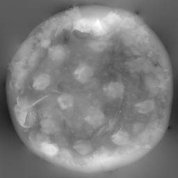
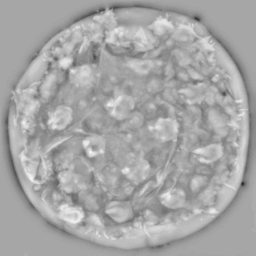
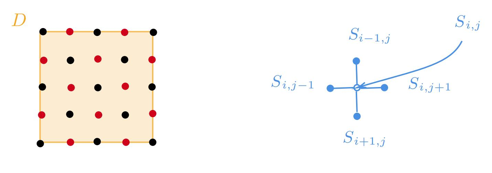
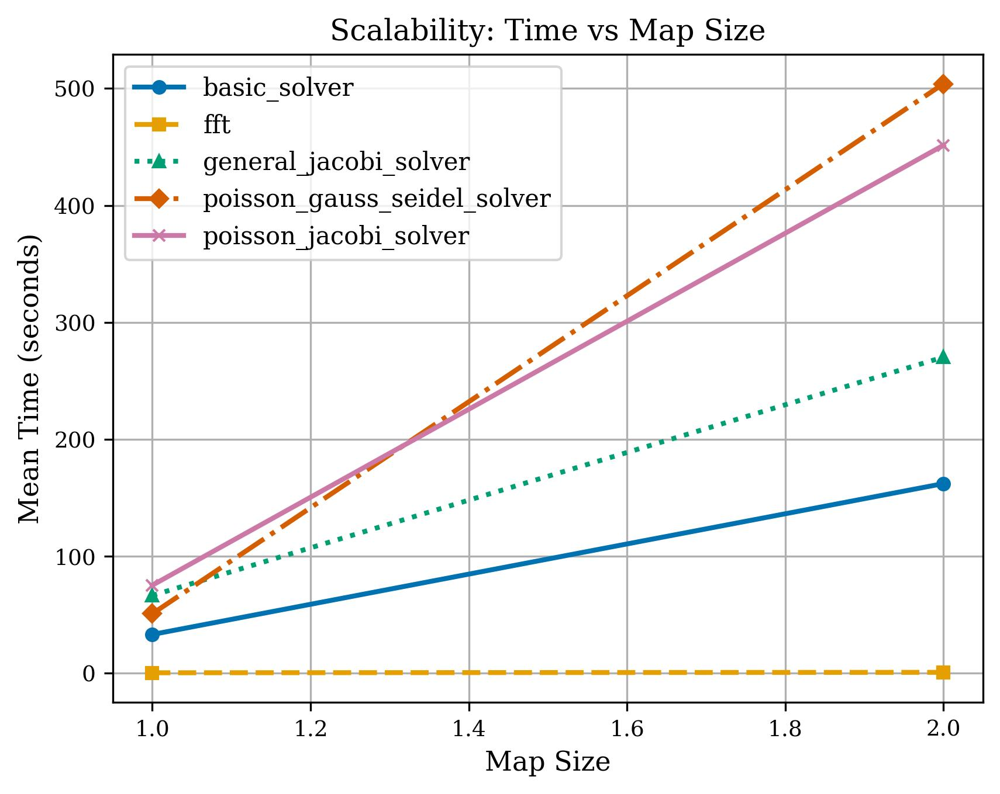
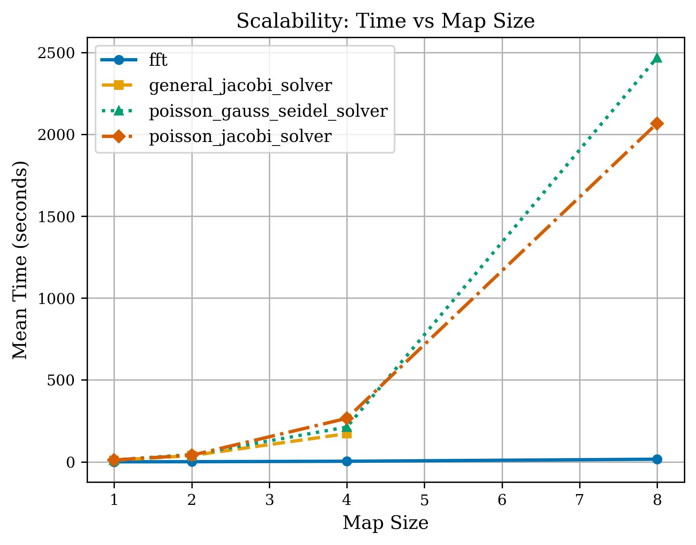
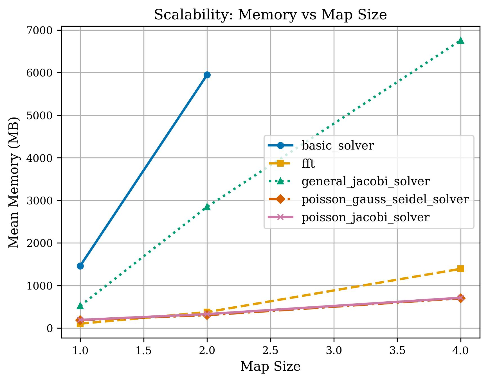
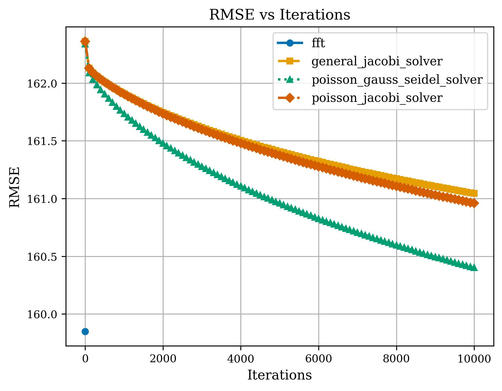
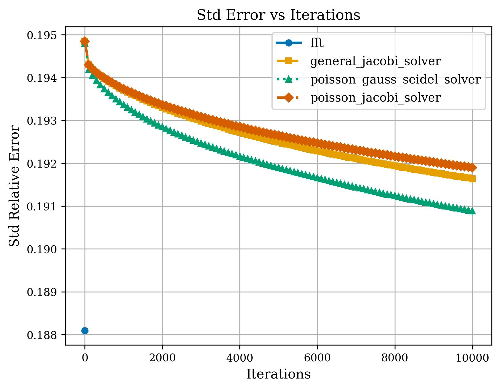
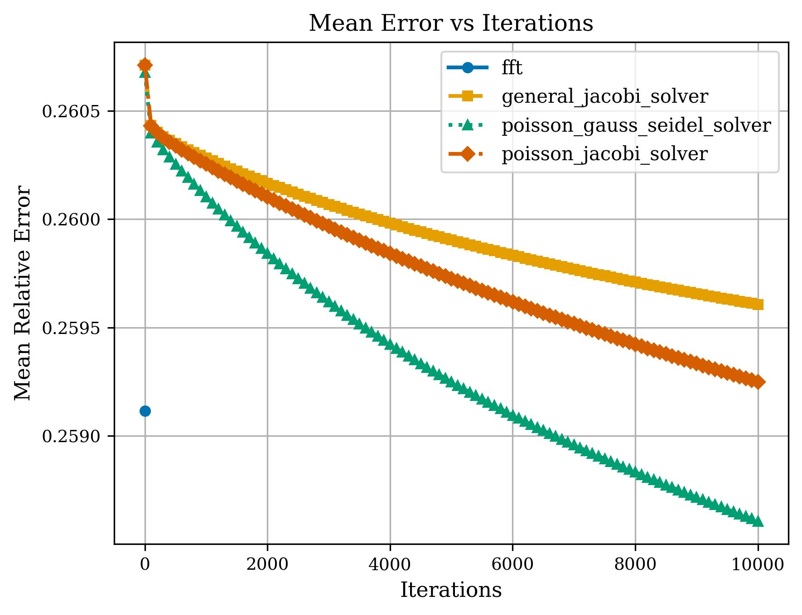
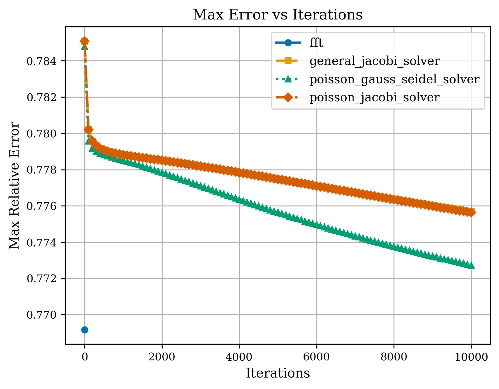

## About the Project

Turning flat photographs into 3D models, detecting subtle surface defects in manufacturing, or measuring skin wrinkles all require an understanding of a surface's three-dimensional shape. One way to recover this information is by estimating a **height map**--a representation of how the surface rises and falls--from a **normal map**, which describes the orientation of the surface at each pixel.

While a normal map captures the direction each tiny patch of the surface is facing, it does not directly provide the actual height. Recovering those heights is a challenging mathematical problem with no exact solution for general surfaces, so practical algorithms rely on numerical approximations.

Since modern images often contain millions of pixels, reconstructing a height map can become computationally expensive. To address this, I implemented and evaluated several reconstruction methods, comparing their execution time, memory consumption, and reconstruction accuracy.

Because these algorithms are highly parallelizable, they are well suited for execution on modern GPUs. To create a portable, cross-platform solution, I implemented the GPU kernels using [**OpenCL**](https://www.khronos.org/opencl/), with **Python** serving as the host language.

### Links

- The source code is available in this GitHub repository (...).
- A future blog post will discuss the algorithms, implementation details, and performance evaluation in depth.

 

The following sections outline the key details of the project.

## Problem Formulation

Before implementing any reconstruction algorithm, the problem must first be formulated mathematically.

Let $S : D \subset \mathbb{R}^2 \rightarrow \mathbb{R}$ denote the unknown height function, where $D$ is the image domain. Our goal is to reconstruct $S$ given only the surface normal field

$$
\vec{n}(x, y) = \bigl(n_1(x, y), n_2(x, y), n_3(x, y)\bigr).
$$

It can be shown that the surface normals satisfy the following first-order system:

$$
\begin{cases}
\dfrac{\partial S}{\partial x}(x, y) = -\dfrac{n_1(x, y)}{n_3(x, y)},\\[0.8em]
\dfrac{\partial S}{\partial y}(x, y) = -\dfrac{n_2(x, y)}{n_3(x, y)}.
\end{cases}
$$

In practice, normal fields are affected by noise and discretization, so an exact solution generally does not exist. Instead, the problem is reformulated as a least-squares optimization, leading to the following Poisson equation:

$$
\begin{align}
\begin{cases}
\dfrac{\partial^2 S}{\partial x^2}
+
\dfrac{\partial^2 S}{\partial y^2}
=
\dfrac{\partial p}{\partial x}
+
\dfrac{\partial q}{\partial y},
\quad \text{on } D,\\[0.8em]
S(x_\ast, y_\ast)=0,
\end{cases}
\end{align}
$$

where

$$
p := -\frac{n_1}{n_3},
\qquad
q := -\frac{n_2}{n_3}.
$$

Because the normal field determines only surface gradients, the reconstructed height is defined only up to an additive constant. Fixing the height at a single reference point guarantees a unique solution.

## Numerical Methods

After reformulating the problem as a Poisson equation, the remaining task is to solve it numerically. Since an analytical solution is generally unavailable, the equation is first discretized into a linear system.

### Discretization

The continuous domain is sampled on a regular grid, where each grid point corresponds to a pixel in the input normal map.

Using finite difference approximations, the Poisson equation becomes

$$
\begin{align}
\begin{cases}
S_{i + 1, j} + S_{i, j + 1} + S_{i - 1, j} + S_{i, j - 1}
- 4S_{i, j}
=
h^2(\Delta p_{i, j} + \Delta q_{i, j}),\\
\text{where } i = \overline{0, m - 1}, \quad j = \overline{0, n - 1},\\
S(x_\ast, y_\ast) = 0.
\end{cases}
\end{align}
$$

where $S_{i,j}$, $p_{i,j}$, and $q_{i,j}$ denote the sampled values at the grid points, and $\Delta p_{i,j}$ and $\Delta q_{i,j}$ are their corresponding finite difference approximations.

A straightforward approach is to solve the resulting linear system using **Gaussian elimination**. However, this quickly becomes impractical: a dense system corresponding to a 1K image would require roughly **8&nbsp;TB of memory**, making direct methods unsuitable for high-resolution images.

Instead, I implemented iterative solvers such as **Jacobi** and **Gauss--Seidel**, which repeatedly refine an initial estimate until convergence. These methods require only local updates, making them well suited for GPU execution. While Gauss--Seidel is slightly more complex to parallelize, it reuses values computed during the current iteration and typically converges in about half the number of iterations required by Jacobi.

Technical details

To remove the additive constant, the height at a reference point is fixed:

$$
S_{0,0} = S(x_{0,0}, y_{0,0}) = 0.
$$

Substituting this constraint into the linear system removes one unknown, yielding a unique solution.

Let

$$
Ax=b,
$$

be the resulting linear system, where $$A=[a_{ij}]$$ is the sparse coefficient matrix, $$x$$ is the vector of unknown heights, and $$b$$ contains the discretized right-hand side computed from the normal field.

The coefficient matrix can be decomposed as

$$
A = D - L - U,
$$

where $$D$$ is the diagonal of $$A$$, while $$-L$$ and $$-U$$ are its strictly lower and upper triangular parts.

Using this decomposition, the **Jacobi** iteration is

$$
\begin{align*}
x^{(k + 1)}
&=
D^{-1}(L + U)x^{(k)} + D^{-1}b,\\
x_i^{(k + 1)}
&=
\frac{1}{a_{ii}}
\left(
b_i
-
\sum_{j \ne i} a_{ij}x_j^{(k)}
\right).
\end{align*}
$$

The **Gauss--Seidel** iteration is

$$
\begin{align*}
x^{(k + 1)}
&=
(D - L)^{-1}Ux^{(k)} + (D - L)^{-1}b,\\
x_i^{(k + 1)}
&=
\frac{1}{a_{ii}}
\left(
b_i
-
\sum_{j=1}^{i-1} a_{ij}x_j^{(k+1)}
-
\sum_{j=i+1}^{N} a_{ij}x_j^{(k)}
\right).
\end{align*}
$$

For this discretization, the coefficient matrix satisfies the conditions required for convergence of both methods.

The key difference between the two algorithms is that **Gauss-Seidel** immediately reuses values computed during the current iteration, whereas **Jacobi** uses only values from the previous iteration. Although this introduces data dependencies, they can be eliminated using **red-black ordering**, allowing Gauss-Seidel to be efficiently parallelized on the GPU without additional synchronization.

### Fast Fourier Transform (FFT)

**Idea:** represent the unknown surface as a sum of Fourier basis functions. In the frequency domain, the Poisson equation becomes algebraic, allowing each frequency component to be solved independently.

The functions $S(x, y)$, $p(x, y)$, and $q(x, y)$ can be expanded as linear combinations of the complex exponentials

$$
e^{j\omega \cdot (x, y)} := e^{j(\omega_x x + \omega_y y)},
$$

where

$$
\omega \in \Omega :=
\left\{
(2\pi k, 2\pi l)
\;\middle|\;
k = \overline{0, m-1},
\;
l = \overline{0, n-1}
\right\},
$$

and $j := \sqrt{-1}$.

Instead of iteratively updating pixel values, the unknown Fourier coefficients of $$S$$ are computed directly from the known coefficients of $p$ and $q$. The reconstructed height map is then obtained by applying the inverse Fast Fourier Transform (IFFT).

Compared to iterative methods, the FFT approach computes the solution in a single pass with a time complexity of $O(N \log N)$, where $N = m \times n$ is the number of pixels. Because the solution is obtained globally rather than through local updates, it also avoids the accumulation of local approximation errors.

Technical details

The unknown surface can be expanded as

$$
S(x, y)
=
\sum_{\omega \in \Omega}
C(\omega)
e^{j\omega \cdot (x, y)},
\qquad
C(\omega) = \, ?
$$

Applying the Laplacian gives

$$
\frac{\partial^2 S}{\partial x^2}
+
\frac{\partial^2 S}{\partial y^2}
=
\sum_{\omega \in \Omega}
\left(
-C(\omega)(\omega_x^2+\omega_y^2)
\right)
e^{j\omega \cdot (x, y)}.
$$

Similarly,

$$
\begin{align*}
p(x, y)
&=
\sum_{\omega \in \Omega}
C_p(\omega)
e^{j\omega \cdot (x, y)},\\
q(x, y)
&=
\sum_{\omega \in \Omega}
C_q(\omega)
e^{j\omega \cdot (x, y)}.
\end{align*}
$$

Therefore,

$$
\frac{\partial p}{\partial x}
+
\frac{\partial q}{\partial y}
=
\sum_{\omega \in \Omega}
\left(
C_p(\omega)\omega_x
+
C_q(\omega)\omega_y
\right)
j
e^{j\omega \cdot (x, y)}.
$$

Matching the Fourier coefficients yields

$$
C(\omega)
=
-
\frac{
\left(
C_p(\omega)\omega_x
+
C_q(\omega)\omega_y
\right)
j
}
{\omega_x^2+\omega_y^2},
\qquad
\forall\;
\omega\in\Omega\setminus\{(0,0)\}.
$$

The coefficients $C_p(\omega)$ and $C_q(\omega)$ are computed using the FFT. After applying the frequency-domain filter above, the reconstructed surface is obtained by applying the inverse FFT to $C(\omega)$.

**Note:** This formulation assumes periodic boundary conditions. When these assumptions are not satisfied, iterative methods provide a more general approach for solving the reconstruction problem.

## Performance Evaluation

[Convergence](#convergence)

[Numerical methods](#numerical-methods)

- experimental setup
- TODO: add concrete image results or gifs somewhere

### Scalability

- CPU

- GPU

### Memory Usage

### Convergence

`

## Conclusion

- FFT solvers deliver the best performance-accuracy tradeoff when applicable
- Iterative methods handle more general problems, trading some accuracy for lower memory usage
- Parallel computing is crucial for making iterative methods practical at scale

## References

The mathematical background and algorithms presented in this project were independently derived and implemented based on the following references.

1. Somogyi, I., & András, Sz. (2009). _Numerikus Analízis_. Presa Universitară Clujeană.

2. Frankot, R. T., & Chellappa, R. (1988). _A Method for Enforcing Integrability in Shape from Shading Algorithms_. _IEEE Transactions on Pattern Analysis and Machine Intelligence_. [[PDF]](https://webdocs.cs.ualberta.ca/~vis/courses/CompVis/readings/photometric/FrankotIntegrpami88.pdf)

3. Gemignani, L. _Basic Iterative Methods – Lecture Notes_. University of Pisa. [[PDF]](https://pages.di.unipi.it/gemignani/lecture1.pdf)

4. Eding, M. _Sparse Matrices (Interactive Article)._ [[Website]](https://matteding.github.io/2019/04/25/sparse-matrices/)

5. ambientCG. _Free PBR Textures, HDRIs and 3D Models._ [[Website]](https://ambientcg.com/)
