<!--
- ~~Why should I care?~~
  - ~~Problem: single-embedding representation in text based recommendation systems could be bounded by not only the natural language, but by the geometry. Why is it true and how can this shown/demonstrated?~~
- ~~What did this person actually do?~~
  - ~~Reproduced main experiments of the DeepMind paper~~
  - ~~Compared my results with the original findings, and they lined up (mostly...)~~
  - ~~Presented my findings with the paper on a research group seminar~~
- ~~What sklills does this demonstrate?~~
  - ~~Research paper reading and understanding~~
  - ~~Interpreting the key ideas, down-scaling parameters to be reproducable on limited hardware~~
  - ~~Compared results trying to measure the similarities with different metrics~~
- ~~Can this person debug and think?~~
  - ~~One of the formulas contain a type: read the coressponding litteracy, understand what the formula, read the original code and spotted the typo~~
  - ~~At the LIMIT dataset analyzation the numbers were wrong. The issue wasn't found, so I asked the author, and we figured it out what went wrong.~~
  - ~~The free embedding expering had wierd results. I somehow understood what was my architecture doing, and realized that I put the wrong place the batch norm.~~
- Did it actually work?
  - yes, by getting similar tendencies in the results
- Is it worh digging deeper?
  - yes, if there are diagrams and intuitie, high level explanations -->

## Problem and Motivation

Some **recommendation systems** — like those that suggest **movies**, **books**, or **products** — compress each item into a **single embedding**. This creates an inherent **capacity limit**: beyond a certain scale, the system cannot reliably distinguish relevant items, leading to measurable retrieval inaccuracies. My project reproduced experiments from a [**DeepMind research paper**](https://arxiv.org/abs/2508.21038v1) to investigate and confirm these limits.

## Approach and Challenges

During the project, I **designed and scaled experiments** to run efficiently on **limited hardware** while keeping results reproducible.
I interpreted multiple metrics to analyze trends, compared findings to the original study, and ensured consistency.
Along the way, I solved subtle challenges, such as **correcting a formula typo**, **resolving dataset inconsistencies**, and **fixing unexpected behavior** caused by batch normalization placement -- all through careful debugging and cross-referencing the [original code](https://github.com/google-deepmind/limit).

## Results

Finally, I presented the results in a [research group](https://datam1n.github.io/) seminar, demonstrating that the reproduced trends aligned closely with the original study. This project strengthened my skills in **research and analysis**, **experimental design**, **data interpretation**, and **problem-solving**, while giving me hands-on experience with [Python](https://www.python.org/), [PyTorch](https://pytorch.org/), [NumPy](https://numpy.org/), [Pandas](https://pandas.pydata.org/), [Sentence-Transformers](https://www.sbert.net/), [Hugging Face](https://huggingface.co/) and [Milvus](https://milvus.io/).

### Links:

- [GitHub repository](https://github.com/gabor-hosu/embedding_dimension_limit) with the source code.
- [Hugging Face collection](https://huggingface.co/collections/gabor-hosu/embedding-based-retrieval-paper-reproduction) with the used quantized models and reproduced datasets.
- The delivered [presentation](https://github.com/gabor-hosu/embedding_dimension_limit/blob/main/presentation.pdf) from the research group's seminar.

### Experimental setup

While the original work used high-end GPUs and TPUs, I reproduced the experiments on **Kaggle P100, T4 GPUs** by optimizing for limited hardware.

### Best case optimization

Even in **ideal conditions**, a **single embedding** can represent only a **limited number of documents**. My reproduction confirmed the paper’s finding that **increasing embedding size** helps only gradually and still leads to practical limits. This suggests an inherent constraint in many **recommendation systems**.

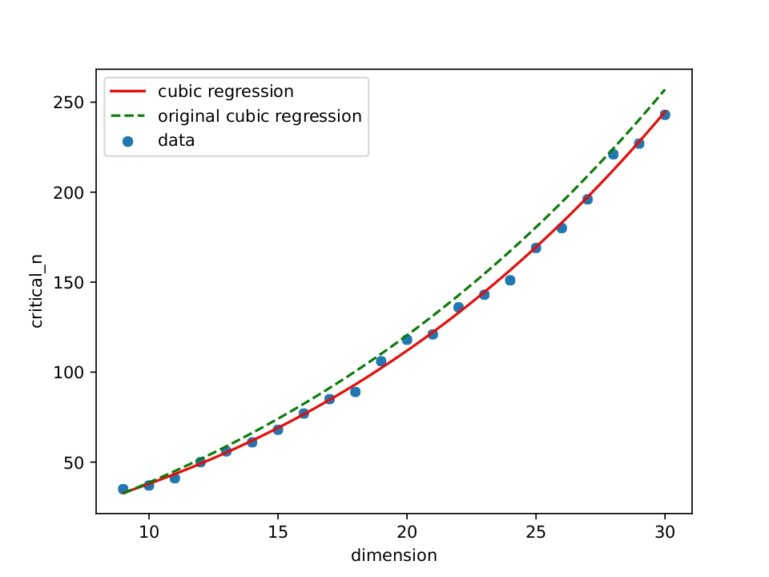

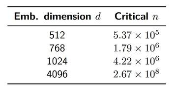

Technical details

- The original paper designed a **dense query-relevance pattern** without natural language.
- A fixed number of query and document embeddings were **optimized directly using gradient descent** to find the **maximal number of representable documents** for a given embedding dimension.
- The results were later approximated using a **cubic regression**, allowing extrapolation to larger embedding sizes.
- My reproduction closely followed the original methodology, confirming the **tendency and upper bounds** reported in the paper.

### Benchmark models on the LIMIT dataset

To test the claims from the previous experiment, I benchmarked several **state-of-the-art embedding models** on the [LIMIT dataset](https://huggingface.co/datasets/orionweller/LIMIT) using a reproducible **IR benchmarking pipeline**, confirming the paper’s main findings about recall limits.

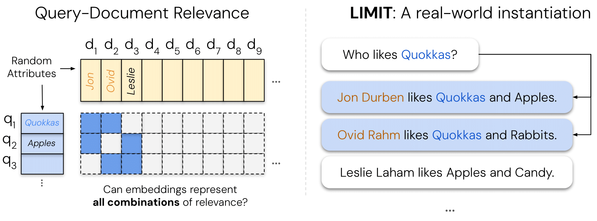

Only a subset of the original benchmark models was used due to hardware limits.

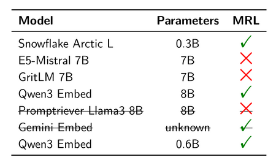

The reproduced results **aligned closely with the original paper**, confirming the trends.

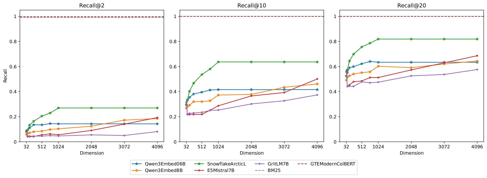

Technical details

- The LIMIT dataset was constructed by **filling the dense query-relevance pattern with natural language text**, allowing realistic testing.
- Due to hardware limitations, I kept **a subset of models** and applied **4-bit quantization** to the largest 7–8B parameter models.
- Evaluation focused on **recall and alignment with the original** study to verify reproducibility.
- Even with quantization, the reproduced trends confirmed the original findings: **embedding-based models are limited in maximum recall**, while non-embedding baselines can reach full performance.

### Domain shift fine-tuning

I reproduced the paper’s domain shift experiment to test whether **general-purpose embedding models** could adapt to the LIMIT dataset.

**Key takeaway:** Fine-tuning did **not reliably improve generalization**, suggesting the dataset’s difficulty comes from its **geometric structure**, not just lack of training.

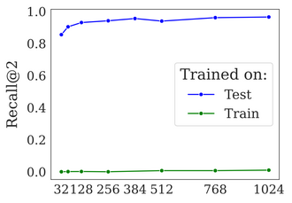

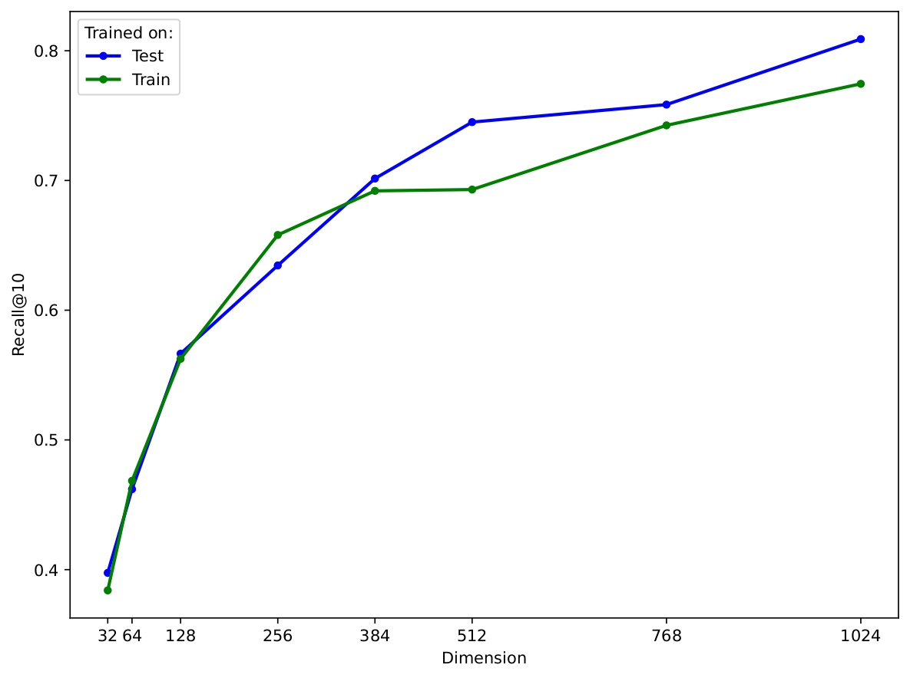

Technical details

- Used [modernbert-embed-large](https://huggingface.co/lightonai/modernbert-embed-large) extended with a linear projection layer for smaller embeddings.
- **Reconstructed the missing train split** following the original dataset’s personal name distribution and attributes.
- In the **original paper**: fine-tuning **on the test split overfit**, while training **on the train split gave near-zero recall**.
- In the **reproduction**: train and test **performances appeared correlated**, possibly due to **stricter dataset** construction and **dense split evaluation**.
- Further discussion of these discrepancies will be covered in a follow-up blog.

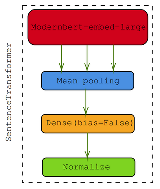

### Effects of differen query-relevance patterns

I explored how **changing the query-document relationships** affects embedding-based model performance.

**Key takeaway:** Dense query-relevance structures **reduce recall** for single-embedding models, highlighting that dataset geometry can strongly influence performance.

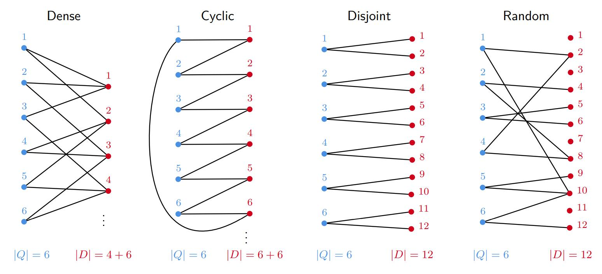

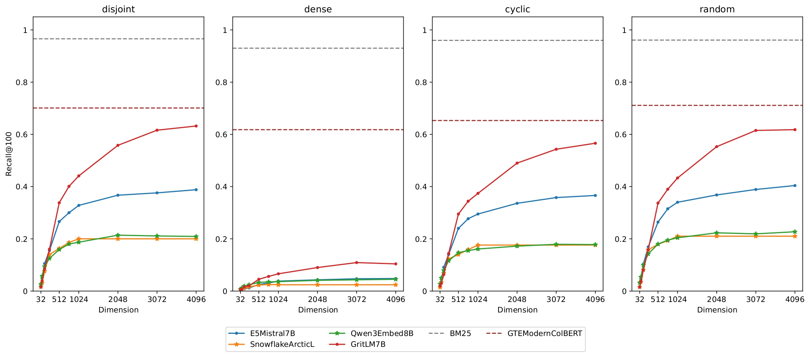

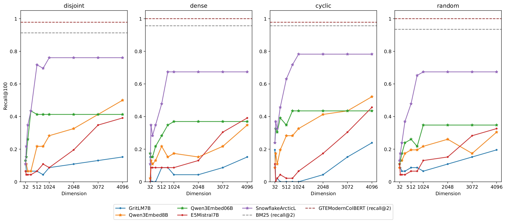

 
  
Technical details

- During reproduction, missing datasets were **generated** based on the original 50K-document scale.
- For practical reasons, I scaled them down to **2K documents**, keeping the same **query-document graph properties** (density, items per query).
- Higher performance of BM25, and ModernColBERT multi-embedding models in my reproduction may be explained by **smaller dataset size** and **4-bit quantization** of the large models.
- The reproduced “random” dataset was made fully dense to illustrate how dense structures can occur in practice.

### Correlation between the BEIR and LIMIT

I compared results on the [**BEIR benchmark**](https://github.com/beir-cellar/beir) with the **LIMIT dataset** to test whether performance trends generalize across tasks.

**Key takeaway:** There was **no significant correlation** between the datasets, both in the original paper and in my reproduced results, confirming that LIMIT captures **unique challenges** not reflected in standard benchmarks.

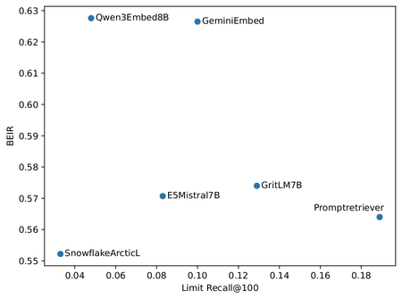

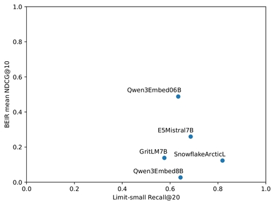

 
Technical details

- Only two BEIR datasets (SciFact and NFCorpus) were used due to **hardware and time constraints**.
- The previously mentioned **quantized models** were evaluated, calculating **NCDQ@10 scores**.
- The original paper did not specify which metrics or exact model evaluations were used, so my reproduction focused on **reproducible comparison** with the available datasets.

